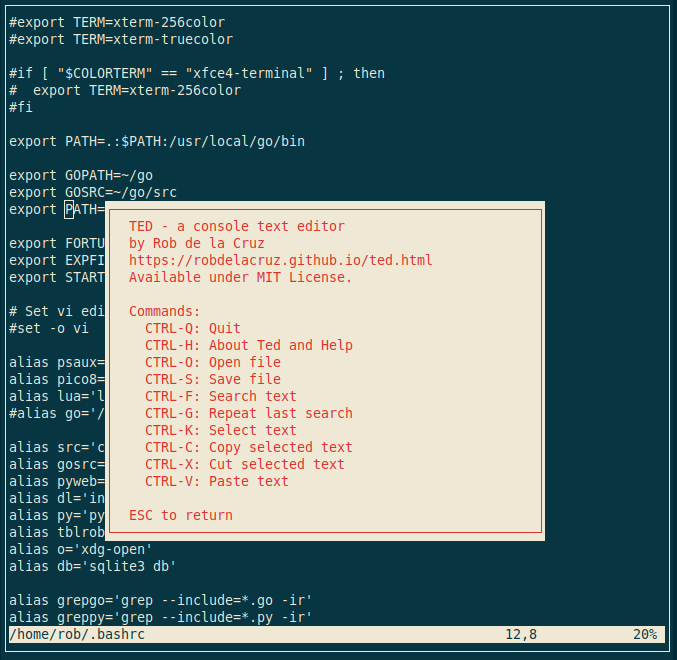
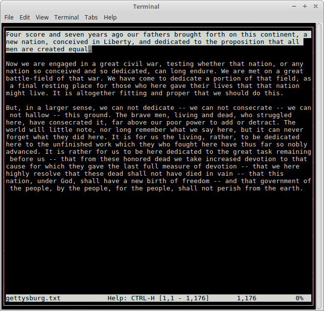
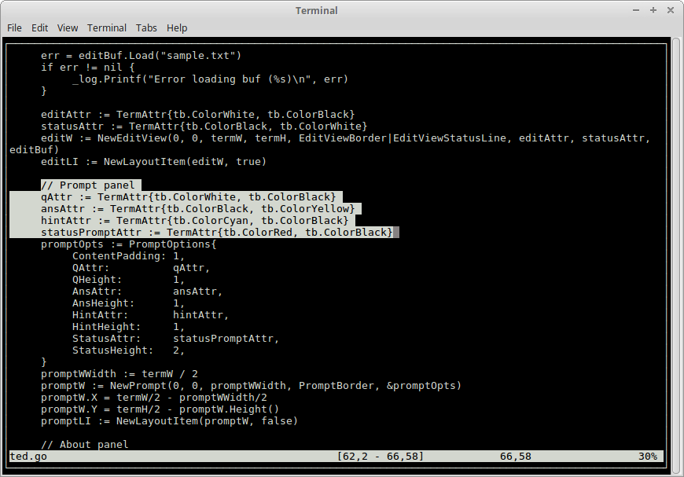

## About ted

ted is a console-based text editor developed in Go and termbox.

- Load, edit, and save plain text files. 
- Select text and copy/cut/paste.
- Search text.
- Keyboard interface
- MIT License

Can be used as teaching tool on programming a text editor from scratch.

[Technical details](https://robdelacruz.github.io/ted.html)

## Build and Install

    $ make dep
    $ make

## Commands

Open a file:

    $ ted <file.txt>

Press CTRL-H to see the list of keyboard shotcuts.

## Screenshots

